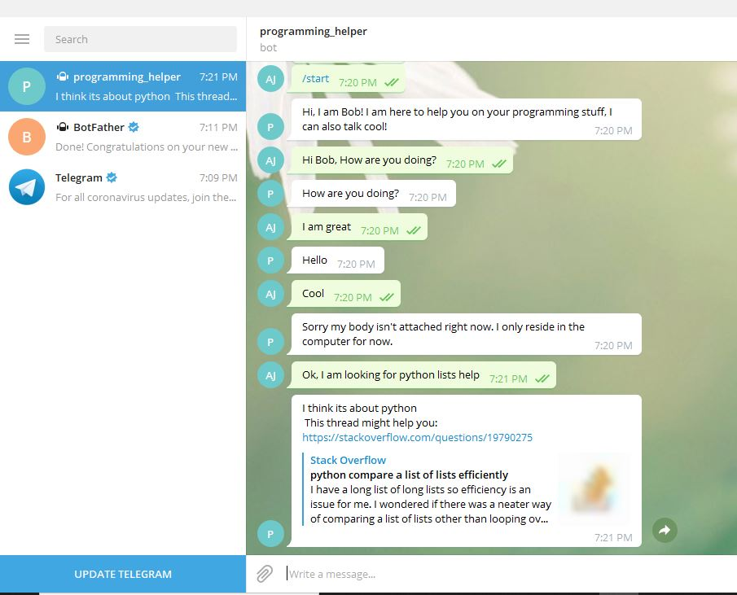

# Introduction  
This is a dialogue chat bot, which will be able to:   
answer programming-related questions (using StackOverflow dataset);
chit-chat and simulate dialogue on all non programming-related questions.
For a chit-chat mode we will use a pre-trained neural network engine available from [ChatterBot (http://chatterbot.readthedocs.io/en/stable/tutorial.html).     
Here you can have a glance of what this chatbot might look like!         
  

## How to use this Chatbot
Clone this repository using  
```
git clone repo_github_url
cd cloned_repo_dir
```
### Create virtualenv using anaconda prompt:
```
virtualenv -p python3 chatbot_venv
source chatbot_venv/bin/activate //for Linux
activate chatbot_venv //windows 
pip install -r requirements.txt
```  
### Setup Database resources 
Download pretrained embeddings and text classification models from this [link](https://drive.google.com/file/d/1SFVwR8JbW6Gbei-eZLdv1A6UQMWcUTac/view?usp=sharing) 
and extract them inside data folder of repository directory.   
If you are using linux use the following way to download embeddings and models:
```
wget --save-cookies cookies.txt --keep-session-cookies --no-check-certificate 'https://drive.google.com/uc?export=download&confirm=e6AN&id=1SFVwR8JbW6Gbei-eZLdv1A6UQMWcUTac' -O- | sed -rn 's/.*confirm=([0-9A-Za-z_]+).*/Code: \1\n/p'
After Running the above line of code will return a code copy that replace as below: 
e.g. Code : YOUR_CODE
wget --load-cookies cookies.txt 'https://drive.google.com/uc?export=download&confirm=YOUR_CODE&id=1SFVwR8JbW6Gbei-eZLdv1A6UQMWcUTac' -O data.zip
```    
And you are done downloading extract and copy to chatbotrepo/data.   
These resources are required by chatbot to distinguish between the context of your questions.    
if you are asking general questions it will give general answers or of you want some programming related questions
it will answer you accordingly.    
### Setup chatbot
We are going to integrate the bot to Telegram messenger. To do so, you will need to create a 
token and use it to run the bot.    
Talk to @BotFather in Telegram after registering on Telegram messenger app. 

The command "/newbot" will create a bot for you.     
You will be prompted to enter a name and a username for your bot. After that, you will be given a token.    
Use this token to make your code work as a backend for your chatbot.    
```
python main_bot.py --token=YOUR_TOKEN
```

